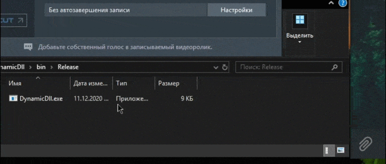
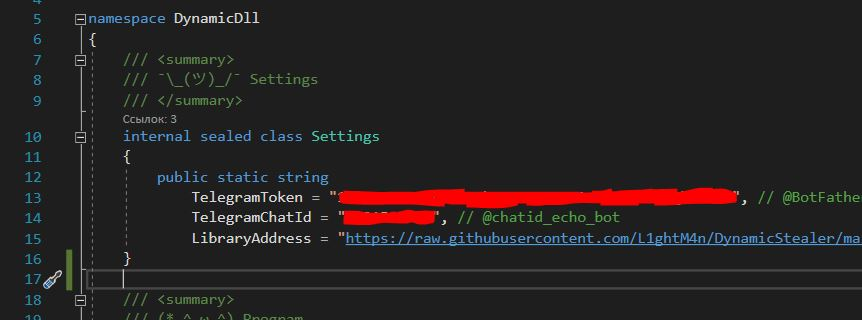

# :key: DynamicStealer
The virus downloads a library with the main functionality and calls the password collection method, and then uploads these passwords to Telegram.

# :airplane: Example

  

# :gear: Settings

  

